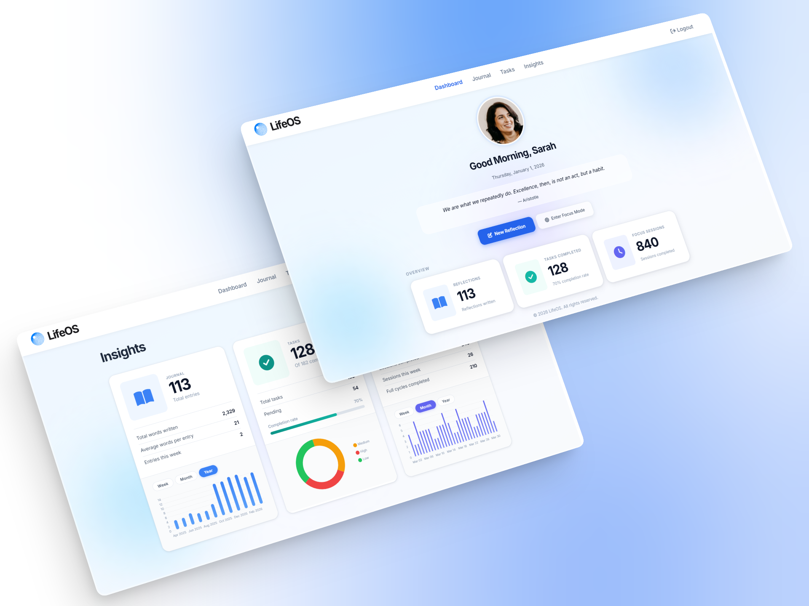

<h1> LifeOS</h1>

A full-stack personal productivity and life management platform built around structured dashboards for reflections, tasks, focus sessions, and insights, helping users take control of their time and stay focused on what matters most.

&nbsp;



&nbsp;

## 📖 Overview

LifeOS brings together journaling, task management, timed focus sessions, and data-driven insights into one platform. Each feature is tied to a secure user account, backed by a live PostgreSQL database, and powered by a RESTful API built entirely with Node.js and Express.

&nbsp;

## 🚀 Live Demo

Deployed on Vercel: **[getlifeos2026.vercel.app](https://getlifeos2026.vercel.app)**

&nbsp;

## ✨ Features

**🏠 Dashboard**
Personalized greeting based on time of day, a motivational quote pulled from an external API, and a live overview of stats across all features.

**📓 Journal**
Create, view, edit, and delete daily reflections. Each entry includes a mood selection (😄 Excellent, 😊 Good, 😐 Okay, ☹️ Bad, 😡 Terrible) and displays with relative timestamps.

**✅ Tasks**
Create and manage tasks with a title, description, and priority level (High, Medium, Low). Supports completion tracking, editing, and deletion. Filter by priority or completion status and sort by date or priority.

**⏱️ Focus Mode**
Pomodoro-style timer with a 25 min focus session, 5 min short break, and 30 min long break. Tracks progress across a 4-session cycle and logs completed sessions to the database.

**📊 Insights**
Overview stats for Journal, Tasks, and Focus Mode with activity charts supporting Week, Month, and Year ranges. Includes a tasks priority breakdown and completion rate progress bar.

**🔐 Authentication**
Email and password signup and login with passwords hashed using bcrypt. Sessions are stored server-side in PostgreSQL and survive server restarts. Protected routes redirect unauthenticated users to login. `Cache-Control: no-store` and a `pageshow` bfcache handler prevent access to protected pages after logout.

&nbsp;

## 🛠️ Tech Stack

| Layer | Technology |
|:---|:---|
| Frontend | EJS templating, CSS, JavaScript (ES6+) |
| Backend | Node.js, Express |
| Database | PostgreSQL hosted on Neon |
| Authentication | bcrypt, express-session, connect-pg-simple |
| Charts | Chart.js |
| Icons | Font Awesome |
| Quotes API | RapidAPI (Famous Quotes, server-side proxy) |
| Deployment | Vercel |

&nbsp;

## 🔍 Implementation Notes

Express handles routing and server-side rendering via EJS. Each feature has its own route file under `routes/` and its own JavaScript module under `public/js/`.

All database tables are scoped by `user_id` with foreign key constraints and `ON DELETE CASCADE`. Sessions are stored in the database and persist across server restarts.

Chart data is fetched client-side via dedicated endpoints that support `week`, `month`, and `year` ranges. All third-party API keys are stored server-side and never exposed to the client.

&nbsp;

## 💻 Running Locally

**1. Clone the repo and install dependencies**

```bash
git clone https://github.com/awcodes22/LifeOS.git
cd LifeOS
npm install
```

**2. Create a `.env` file in the project root**

| Variable | Description |
|:---|:---|
| `DATABASE_URL` | Neon PostgreSQL connection string |
| `SESSION_SECRET` | Secret key for signing session cookies |
| `RAPIDAPI_KEY` | RapidAPI key for the Famous Quotes API |
| `NODE_ENV` | Set to `development` for local use |

```
DATABASE_URL=your_neon_connection_string
SESSION_SECRET=your_session_secret
RAPIDAPI_KEY=your_rapidapi_key
NODE_ENV=development
```

**3. Set up the database**

Run `schema.sql` against your PostgreSQL instance to create the required tables:

```bash
psql your_database_url -f schema.sql
```

**4. Start the server**

```bash
npm start
```

Open `http://localhost:3000` and sign up for an account.

**5. (Optional) Load sample data**

Update the email at the top of `sample_data.sql` to match the account you signed up with, then run:

```bash
psql your_database_url -f sample_data.sql
```

This populates your account with 3 journal entries, 5 tasks, and 10 focus sessions so you can see the Insights page working with real data.

&nbsp;

## 📁 Project Structure

```
LifeOS/
├── index.js                  # Express server, middleware, page routes, quote proxy
├── db.js                     # PostgreSQL connection pool
├── vercel.json               # Vercel deployment config
├── schema.sql                # Database table definitions
├── sample_data.sql           # Optional sample data for testing
├── routes/
│   ├── auth.js               # Signup, login, logout
│   ├── journal.js            # Journal CRUD API
│   ├── tasks.js              # Tasks CRUD API
│   ├── focus.js              # Focus session logging API
│   └── insights.js           # Aggregated stats and chart data API
├── views/
│   ├── index.ejs             # Dashboard
│   ├── journal.ejs           # Journal page
│   ├── tasks.ejs             # Tasks page
│   ├── focusMode.ejs         # Focus Mode page
│   ├── insights.ejs          # Insights page
│   └── auth/
│       ├── login.ejs         # Login page
│       └── signup.ejs        # Signup page
└── public/
    ├── js/
    │   ├── dashboard.js      # Dashboard interactions and stat loading
    │   ├── journal.js        # Journal CRUD and modal logic
    │   ├── tasks.js          # Task rendering, filtering, sorting
    │   ├── focus.js          # Pomodoro timer logic and session tracking
    │   ├── insights.js       # Chart rendering and range switching
    │   └── auth.js           # Password toggle and bfcache protection
    └── styles/
        ├── styles.css        # Global styles, CSS variables, shared components
        ├── dashboard.css
        ├── journal.css
        ├── tasks.css
        ├── focus.css
        ├── insights.css
        └── auth.css
```

